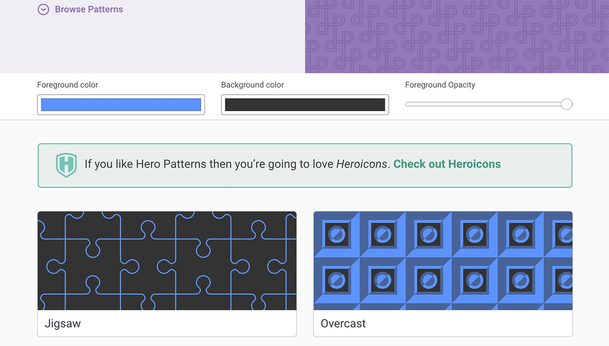
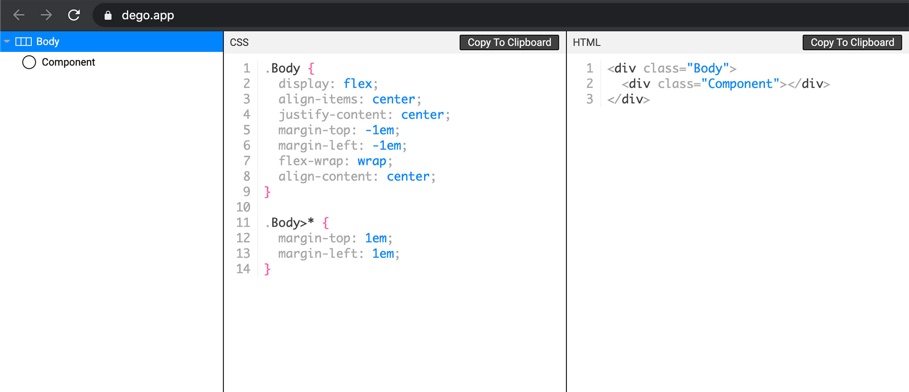
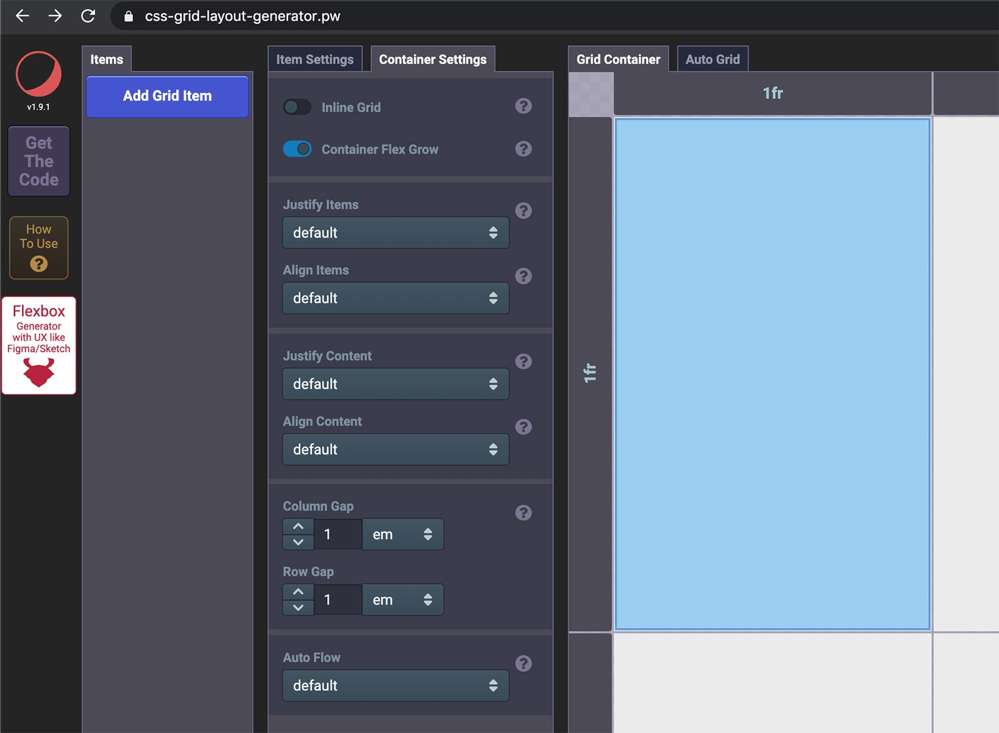
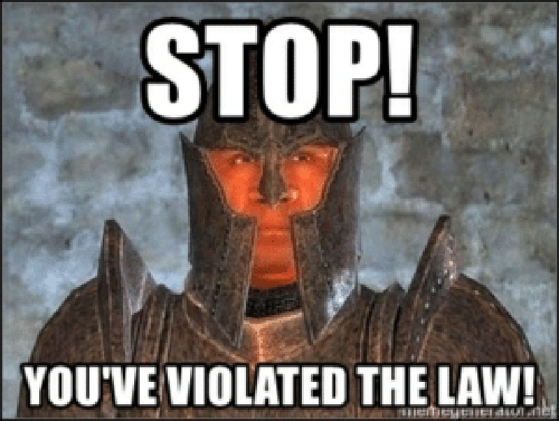

# Hello!

Today I thought I'd share some super-handy-dandy tools I've found useful during my short time as a fledgling web developer. Specifically, we're gonna take a look at some really cool CSS generators.

### A CSS "generator?"

Yes! These are graphical web apps you can access from anywhere that let you tick some boxes, move some sliders and then voila! Out comes valid CSS! They even have live previews so you can see exactly what you're doing. Whoever made theses things are some serious geniuses, I tell you. They really do simplify some common tasks quite a bit if you aren't already a CSS wizard yourself. Which I gotta say, I for one am NOT. CSS and I have a very strange relationship right now. But enough about me! Let's see those tools! 

## Number one: Hero Patterns

Ever wish you had a fancy-shmancy background on your site, but don't have a designer? Or worse: you do have a designer, but they only know how to design image assets like PNG and JPEG? (I kid.) Well here comes **Hero Patterns** to the rescue! 

Choose one of their background designs, then choose some colors and their opacity, and presto! There's your CSS expressing that background! Makes sprucing up a blank page a little easier, donchathink?

[heropatterns.com](https://www.heropatterns.com/)

## Number two: dego.app

This one is actually my favorite of the three we're looking at today, because it comes in handy so darn often. Stupid `flex` layouts!  Y u no work? Maybe I just suck at using `display: flex`. You know what doesn't suck at `flex` layouts though? This tool! 

First you use their graphical tool to define the flex attributes for a parent component that is going to hold some child components you want help with laying out properly. 

Next, you can generate some visual placeholder components that will be governed by the parent's flex rules, and you can even set the child flex properties available in CSS 3. (At least, this is how I use this tool.) 

Finally, you click 'Export' at the bottom of the page and choose whether to generate HTML or even React JSX along with CSS, all according to the way you set the properties earlier! SO DANG HELPFUL! But don't thank me; in fact, there's a donate link on that page which I would use if I wasn't in thousands of dollars of debt! Maybe you should consider using it if you find the tool as useful as I do. Just a thought :)

[dego.app](https://dego.app/)

## Number three: CSS Grid Layout Generator

 If you're anything like me, trying to use CSS Grid normally is a surefire way to melt your brain. This tool changes that, although even with the tool I *still* end up with a bit of brain melt going on sometimes. But there is no better tool I've come across. I have tried a lot of CSS Grid generators, this one is one of the most complete ones out there (although some with less features may be a little simpler to get started with). 

This one either fully implements the CSS3 Grid specification in a graphical form, or it gets darn close. There's really not much you can't do with it. Need a responsive grid for your site's main layout? Look no further! Need to arrange some images automatically in a gallery component? **STOP RIGHT THERE CRIMINAL SCUM!** Nobody tries to do implement a CSS Grid-based gallery in a text editor on my watch! Now it's off to [css-grid-layout-generator.pw](https://css-grid-layout-generator.pw/) with you!

## Wrapping up

I hope you found this something in this list useful! If you find any similar cool CSS generator tools that you would like to share, feel free to leave a comment if you are visiting this page after I finally fix my comment system!

Thanks for reading :)
