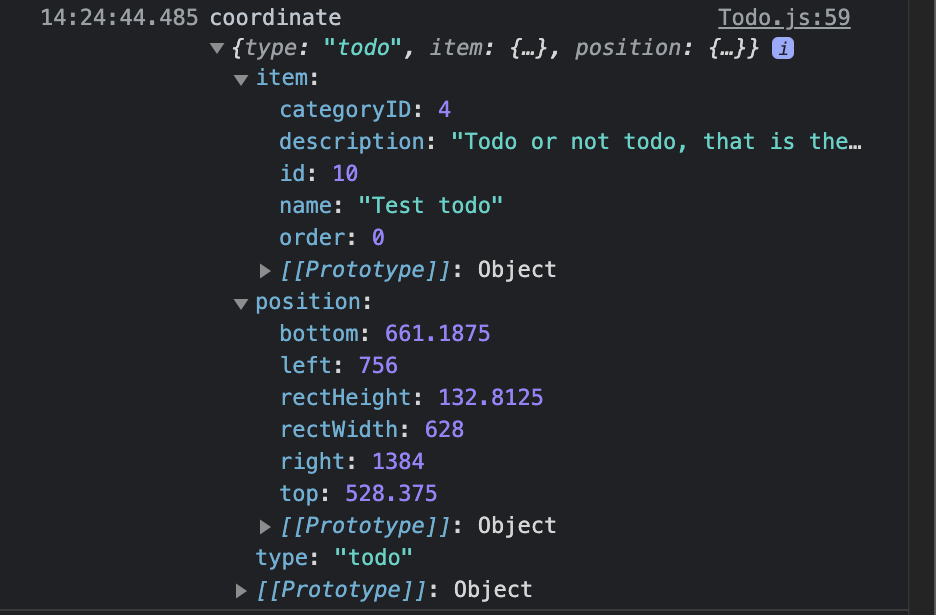

## Hello!

Today I'd like to talk a little bit about the latest project I've been working on again.

### Background

For a quick bit of background, it's my last project at Flatiron, and they wanted us to make something with React and Redux this time, using Rails in API mode as a backend like our Javascript project prior. Once again, the rules were pretty flexible in terms of scope and subject. I had been messing around with Trello for a bit prior to starting and was inspired by its simple interface. So, without a better idea of what to build suddenly popping into my head, I set off to make a todo list app but decided to try to spice it up a bit by giving it a drag and drop interface that lets you categorize and reorganize your tasks.


Maybe I could have used some drag and drop library that did a bit more of the work for me (like sorting the dropped elements), but since this is supposed to show off what I can do and not what some library can do, I originally went about creating my own set of components to handle all the drag and drop logic. I actually got pretty far, in that early on it seemed to work reliably, but as my app grew it kept seeming to break itself, in that every new feature I added caused my system to quit working for various reasons. Also, it wasn't super performant to begin with. Since I had a fast approaching deadline I scrapped the part of my system that handled making things draggable and droppable and replaced it with `react-dnd`, which was the lowest-level drag and drop library I could find.

Through that route, and some couple-hundred or so commits later, I eventually ended up with an app that I am quite happy about! Of course, I had some help from a few libraries besides `react-dnd`. Let's have a look at the overall structure and design of my app then, including the work it depends upon.

## Design overview

 So that credit goes where it's due, I will quickly sum up the bits and pieces I used to build this project below. Bear in mind that the base structure without any functionality came from a repo my school provided as an option so that we could easily host our project on Heroku if we wanted to. I opted to use it so I could spent more time on the implementation side of things versus fiddling with deployment. Anyway, have a look at the dependencies of my app below.

### Dependencies

- [Rails](https://rubyonrails.org/) (bootstrapped in API mode), along with these gems:
  - [jsonapi.rb](https://github.com/stas/jsonapi.rb) for easy data serialization
  - [devise](https://github.com/heartcombo/devise) and [devise-jwt](https://github.com/waiting-for-dev/devise-jwt) to handle user authentication (through [JSON web tokens](https://jwt.io/introduction))
- [React](https://reactjs.org/) (bootstrapped through [create-react-app](https://reactjs.org/docs/create-a-new-react-app.html#create-react-app))
- [Redux](https://redux.js.org/) and [react-redux](https://react-redux.js.org/) for handling state management
- [redux-thunk](https://github.com/reduxjs/redux-thunk) for dispatching asynchronous actions to Redux that interact with my Rails API
- [redux-views](https://github.com/josepot/redux-views) for memoization of complex Redux selectors
- [React Router](https://reactrouter.com/) for handling clientside routing
- [react-slick](https://react-slick.neostack.com/) for the 'Recent projects' homepage slider widget
- [react-dnd](https://react-dnd.github.io/react-dnd/about) with `react-dnd-html5-backend` for making components draggable and droppable
- [use-resize-observer](https://github.com/ZeeCoder/use-resize-observer) for monitoring element resize events
- [react-merge-refs](https://github.com/gregberge/react-merge-refs) to make it easy to use `react-dnd` and `use-resize-observer` refs on the same element
- [lodash](https://lodash.com/) for its [debounce](https://lodash.com/docs/4.17.15#debounce) method to improve performance of my element position tracking system when listening for rapidly repeating events
- [uuid](https://www.npmjs.com/package/uuid) for ensuring that elements in my homepage slider widget have unique keys   

<br/>

Many thanks to the authors of all of those libraries for their work!

With those out of the way, I'll go into a bit of detail as to how what I built works on a basic level. I'll start with the backend, describing my models a bit. 

### Backend

- `User` (has some extra attributes generated by Devise that aren't listed)
  - `username`: string
  - `email`: string
  - `encrypted_password`: string 
  - `jti`: string (for the JSON web token)
- `Project`
  - `name`: string
  - `description`: string
  - `order`: integer
  - `private`: boolean
- `Category`
  - `name`: string
  - `description`: string
  - `order`: integer
  - `project_id`: reference
- `Todo`
  - `name`: string
  - `description`: string
  - `order`: integer
  - `category_id`: reference
- `UserProject` (a join table)
  - `user_id`: reference
  - `project_id`: reference
  - `owner`: boolean

<br/>

Those models all have controllers with RESTful routes as well, plus I have a few generated by Devise. So things are fairly simple as far as the backend goes.

### Frontend

The frontend is a bit more interesting!

I basically set things up to mirror the models and associations that are present on the backend. In short, that means that I have Redux reducers and actions set up for all of the above models, with the exception of Users. Instead, I also have a basic set of `authentication` actions and an accompanying reducer that handle the creation of state objects that represent a user. 

In addition, I have a reducer and actions for `coordinates`, whose state objects represent the last known positions of all of the current Project, Category, and Todo component instances.

As far as components go, I have quite a few. I split them into two groups: Page components that represent a full webpage in the app and which have an associated route, and everything else. Pages may access shared state via Redux, but they don't maintain component-level state of their own. The other components that aren't Pages may or may not maintain their own state or access the Redux store; it depends on the component. 

#### React Components

Below are my Page components, with short descriptions of their features:

- `Home`: Has a 'Recent Projects' list and a short list of user instructions, as well as handy signup and login links
- `Projects`: Shows all the users Projects, which may contain any number of Categories the user has created, which themselves may contain any number of Todos, and lets you create or edit any Project, Category or Todo
- `Categories`: Shows only Categories and Todos, lets you create or edit any Category or Todo
- `Todos`: Shows only Todos, let's you create or edit any Todo

<br/>

Very simple! Now here are the rest of my components, with short descriptions of what they are for:

- `Project`: Represents and handles tasks associated with the Project model, acts as the top-level container for Categories
- `Category`: Represents and handles tasks associated with the Category model, acts as the container for Todos
- `Todo`: Represents and handles tasks associated with the Todo model
- `Dropzone`: Implements drop functionality for the above components through `react-dnd`
- `ProjectForm`: Handles creating or editing a Project
- `CategoryForm`: Handles creating or editing a Category
- `TodoForm`: Handles creating or editing a Todo
- `SignupForm`: Form allowing user signup
- `LoginForm`: Form allowing initial user authentication
- `LogoutScreen`: Fullscreen modal dialogue allowing user logout
- `Modal`: Fullscreen modal dialogue implementation
- `ConfirmScreen`: Similar to Modal
- `Loading`: Fullscreen modal dialogue indicating authentication/page load progress
- `Hover`:  Hovering component preview implementation
- `Navbar`: Simple navigation bar allowing access to Pages and the login/logout/signup functionality
- `Footer`: Basic footer with author info/links
- `withAuth`: Higher-order component that handles protecting routes from unauthenticated users, wraps other components that belong to a route

<br/>

Hopefully this is starting to illustrate a basic outline of my project for you. 

## Focusing in on the more noteworthy bits

I think most of my app is pretty standard as far as a React/Rails app of this sort goes, but there is some work that went into it which I think stands out a bit in comparison. I'd like to focus on a few main topics for now: the element position tracking system, the drag-and-drop component resorting algorithm I wrote, and the work that went into ensuring the app remained performant despite everything going on (as there were quite some number of Redux actions firing and React components re-rendering at all times prior to the optimizations I implemented).

### The position tracking system

Part of the problem I faced while trying to implement a drag and drop interface was that `react-dnd` does not provide any implementation of a reordering mechanism for when a component is dragged into a drop container that contains other components. The issue there is that if you drag one component into a certain spot, say in between two others, it should land in that between spot that the user chose, but by default `react-dnd` does nothing to ensure that. Instead, at first components would always end up sorting themselves by whatever order their objects were fetched from the database in. This is frustrating from a user's perspective, so I sought to implement a solution. 

The simplest thing I could think of was to somehow keep track of the positions of all the elements on the current page which were part of a group that the user might want to drag another item into at some specific position. 

#### Coordinates

I started by creating the aforementioned actions and reducer for a basic array of coordinates in my Redux store, including in my implementation a small amount of information about the component that a given set of coordinates belongs to. 

Here is an example of a coordinate object coming from my Redux store:



The `item` key refers to the same object that I use to instantiate a Todo component, which is also what gets saved to the database if any changes are made or if the user creates a new Todo via the TodoForm component. Its `order` property is actually key for my implementation of a sorting algorithm, because it refers to its position within whatever current Category it belongs to, and taken together the order values for all the Todo components in a Category allow for their positions to be successfully maintained according to the user's input upon a drop event.

#### Digging deeper into the problem

Very handily, `react-dnd` provides information about the last known position of an component's containing element when it gets dropped, which I decided I could use as part of a comparison between the dropped component's position and the positions of the other components within the same container.

So in short, I decided all I needed to do was maintain an up-to-date array of coordinates in my Redux store, and then for a given drop event:

1. Loop through the coordinates array, filtering for the coordinates that belong to components within the same drop container
2. Loop through *those* coordinates, comparing their position to the position of the component being dropped being provided by `react-dnd`
3. Run some kind of sorting algorithm that essentially says, 'Okay, for all the components in the same container we just looped through, give them a ranking based on their position within the container, and then ensure that the component currently being dropped has a ranking that falls in the middle of the rankings of the two elements it was between when the user dropped it.'

Creating the coordinate array was quite simple, thanks to Redux and `redux-thunk`. The more difficult parts of the above tasks were that the coordinates array must be **up-to-date**, and figuring out how to rank different elements **properly** in the sorting algorithm.

##### Deeper still

As I was figuring out how to solve this, I realized that while it was simple to have the coordinates get created or updated for a given component instance upon its creation using the `useEffect` hook, and it was just as simple to have it refresh on every component render as well, relying simply on `useEffect` and component render calls actually left things to chance a bit too much, while also slowing my app down a lot more than I was comfortable with. Why?

- Scrolling the page won't always trigger a component re-render, so it would cause my coordinates to be sometimes out-of-date

- My components had CSS styling applied to make buttons appear on hover which caused the components outer element to resize, meaning again that coordinates would be out-of-date when this occurred since a pure CSS transition won't necessarily cause a component re-render either

- Due to some details of my component implementations, fixing those two problems without mitigating how many coordinate updates and render calls are made would cause insane amounts of unnecessary component re-renders given that their render calls depend upon the Redux coordinates state in a few ways

With all that in mind, let's see how I solved those coordinate-tracking problems now 💡

#### The coordinate update system

To update a component's coordinates, first I attach a ref to the outermost element that belongs to the component with `useRef`. Since `react-dnd` was already using an incompatible function ref pointing to the same element, I decided to use `react-merge-refs` to simply solve the issue and allow me to attach a second ref. 

Next, I wrote a simple function that uses the standard Javascript `getBoundingClientRect` method on the element that the ref points to.

Here is that function: 

```jsx
const getCoordinates = useCallback(() => {
  if (ref.current) {
    const rect = ref.current.getBoundingClientRect()
    const coordinates = {
      type: 'todo',
      item: props.todo,
      position: {
        left: rect.left,
        right: rect.right,
        top: rect.top,
        bottom: rect.bottom,
        rectWidth: rect.width,
        rectHeight: rect.height
      }
    }
    dispatch(actions.refreshCoordinates(coordinates))
  }
}, [props.todo, dispatch])
```

I would just provide that function as a callback to an event listener and call it good, but when your event listener is an `onScroll` event, it pays to be careful with how much computation you are doing, given that scrolling is a critical and performance-sensitive way that users will be interacting with the app. So I memoized it with `useCallback`, and then used the `debounce` method from `lodash` to limit how many times the function can run in a given timespan, and then memoized *that*.

Along similar lines as above, I also make use of `useResizeObserver` to watch for any changes in the element's size in a performant way. I could have done something with `getBoundingClientRect` again, but `getBoundingClientRect` is suboptimal because in some browsers it forces a new layout calculation on each call, and my situation is very close to the sort of thing that the `ResizeObserver` API was created for. So I opted to use it in place of some custom solution.

I pass another debounced version of the `getCoordinates` function to my `useResizeObserver` call, which means that for every time a given element resizes within a certain time window, it will update the element's coordinates again. Finally, inside of a `useEffect` call, I attached a scroll event listener to the document body after first doing another call to `getCoordinates` on its own so that coordinates will be updated upon component mounting and subsequent renders. Here is all that code:

```jsx
const onResize = useMemo(
  () =>
  debounce(getCoordinates, 100, {
    maxWait: 200,
    trailing: true
  }),
  [getCoordinates]
)

const onScroll = useMemo(
  () =>
  debounce(getCoordinates, 250, {
    maxWait: 500,
    trailing: true
  }),
  [getCoordinates]
)

useResizeObserver({ ref, onResize })

useEffect(() => {
  getCoordinates()
  document.addEventListener('scroll', onScroll)
  return () => {
    document.removeEventListener('scroll', onScroll)
  }
}, [getCoordinates, onScroll])
```

This is what allows me to keep an up-to-date record of the positions of the components in my app, without destroying performance. Taking those extra steps seemed to make a noticeable difference to the responsiveness of the app in the end, so I'm glad I spent the time.

### The element sorting algorithm

A system of coordinates does no good for me without some way of comparing those coordinates to the position of a dropped component. So in the `Dropzone` component I created, I implemented a sorting algorithm in a `handleDrop` function I created, then I call that function in the `drop` method that comes from `react-dnd`. This method is triggered as soon as a user drops an eligible component into a drop container. So whenever a user drops a Todo into a Category, or a Category into a Project, my function will run so that things land in their proper position.

Here is the drop method from `react-dnd`:

```jsx
drop: (item, monitor) => {
  const result = { element: monitor.getSourceClientOffset() }
  handleDrop(item, result)
  return result
}
```

`getSourceClientOffset` is a method built into `react-dnd ` that grabs the last known position of the element being dropped.

Now here is the `handleDrop` function I am calling inside `drop`. Beware, it is hefty:

```jsx
const handleDrop = useCallback( // 'item' is an object representing the dropped element
  (item, result) => {           // 'result' contains the last known position of the dropped element
    let order = 0               // 'order' will be assigned as the ranking for the element being dropped later
    let i = 0                   // 'i' will be referring to the element whose position is currently being tested
    while (i < childCoordinates.length) {                          // 'childCoordinates' contains the coordinates of elements in the same container
      if (childCoordinates[i].item.id !== item.id) {               // make sure we are not testing the dropped element against itself
        if (result.element.y < childCoordinates[i].position.top) { // the dropped element is above the element being tested
          order = i                                                // set the dropped element's ranking to equal the ranking of the currently tested element
          for (let j = i; j < childCoordinates.length; j++) {      // loop through all the elements below the current one
            if (childCoordinates[j].item.id !== item.id) {
              childCoordinates[j].item.order += 1                  // increment order by one for every element below current (push them below)
            }
          }
          if (i === 0) { // if we hit this then there are no elements above what's being tested to loop through, so break
            break
          }
          for (let j = i - 1; j >= 0; j--) {               // loop through all elements above the current one
            if (childCoordinates[j].item.id !== item.id) {
              childCoordinates[j].item.order -= 1          // increment order by one for every element above what's being tested (push them above)
            }
          }
          break
        } else {         // the dropped element is below the element being tested
          order = i + 1  // set the dropped element's ranking to be the currently tested element's plus one (push it below)
        }
      }
      i++
    }
    // now we need to prepare an array of elements to send to the database in a batch update since their orders were changed
    const childrenToUpdate = childCoordinates.map(coords => coords.item) // grab the representational objects from the coordinates array
    const existingChild = childrenToUpdate.find(
      existing => existing.id === item.id
    )
    if (!existingChild) {                             // the dropped element needs to be added to the array if we hit this
      const child = { ...item, order: order }         // make sure to give it the new order value since we did all that work
      child[`${props.parentType}ID`] = props.parentID // give the dropped element a new parent container since it came from a different container
      childrenToUpdate.push(child)
    } else {
      childrenToUpdate[childrenToUpdate.indexOf(existingChild)].order = order // make sure to set the order value even if it is not being reparented
    }
    childrenToUpdate.sort((child1, child2) => child1.order - child2.order)    // sort all the elements by their updated order values
    for (let i = 0; i < childrenToUpdate.length; i++) {
      childrenToUpdate[i].order = i // make sure that the order values are mapped to the range '0 to childCoordinates.length'...
    }                               // ...since the loop can produce negative order values
    switch (props.acceptType) {     // use the proper action depending on what was dropped
      case 'todo':
        dispatch(actions.batchAmendTodos(childrenToUpdate))
        break

      case 'category':
        dispatch(actions.batchAmendCategories(childrenToUpdate))
        break

      default:
        break
    }
  },
  [
    props.parentID,
    props.parentType,
    props.acceptType,
    childCoordinates,
    dispatch
  ]
)
```

That was a lot maybe, but hopefully the comments help it make sense.

Basically, that sorting algorithm finds all the component instances below the drop position and 'pushes' their coordinate values up. And for the components above the drop position, it pushes their order values down. Then it sets the order value of the component being dropped to be right in the middle, where a 'hole' has been created for it to fit into. It might be some of the more convoluted code I've written, and indeed it took me quite some effort to come up with that solution, but it seems to work nicely. The break statements ensure that not too many iterations will occur despite there being several nested loops. There is a small delay that occurs when dropping a component into a new position, but it seems to come from network latency because of the batch update action being fired instead of the sorting going on.

### Memoization of selectors and components to improve performance

With all the state updates I had going on, and with many of my components relying heavily on the same state, there were originally too many component re-renders occurring for my liking. Scrolling, hovering a button, or practically doing anything at all would cause some of my components to re-render unnecessarily. So I looked for a way to improve the situation and decided to try a couple things: memoizing my most-used selectors, and memoizing the components themselves which relied upon those selectors. `redux-views` and `React.memo` came to the rescue in a big way here, and it wasn't too difficult to implement either, thankfully.

#### Memoizing selectors with redux-views

`redux-views` is a library that makes it simple to memoize complex Redux selectors, even if that selector will be used by multiple instances of the same component. My understanding is that Redux selectors can be memoized but if that selector is used by multiple component instances (like in my case), it becomes tricky. Indeed, I struggled to come up with any improvements until I tried reaching for `redux-views`. Here is an example of how to construct a memoized selector with `redux-views`:

```jsx
const selectCoordinates = state => state.coordinates

const selectAcceptType = createIdSelector(props => props.acceptType)

const selectParentType = createIdSelector(props => props.parentType)

const selectParentID = createIdSelector(props => props.parentID)

const filterCoordinates = (coordinates, acceptType, parentType, parentID) =>
  coordinates
    .filter(
      coords =>
        coords.type === acceptType &&
        coords.item[`${parentType}ID`] === parentID
    )
    .sort((coords1, coords2) => coords1.item.order - coords2.item.order)

const makeSelectChildCoordinates = createSelector(
  [selectCoordinates, selectAcceptType, selectParentType, selectParentID],
  filterCoordinates
)
```

First, you must create functions that accept the Redux state as an argument and returns the state necessary for your final selector.

Next, you may optionally use `createIdSelector` to let your final selector accept certain parameters to help you filter the state based on external variables.

Then, you provide a filter function that accepts the relevant state returned from Redux and filters it based on whatever constraints you require to achieve a desired final output. 

Finally, you use `createSelector`, passing in those earlier functions as arguments to receive as output a final parameterized selector that only returns the state you want. 

Here is how I used my final selector creator within my `Dropzone` component:

```jsx
const childCoordinates = useSelector(state =>
  makeSelectChildCoordinates(state, props)
)
```

`useSelector` comes from standard Redux, and all you need to do is pass in the return of your selector creator, giving it arguments of state from your Redux store, as well as any parameter variables that your selector relies on for its filter function. Not too bad!

#### Memoizing components with React.memo

Since I built my app with hooks, the class component way of inheriting from `PureComponent` is not available to me to try as a way of increasing performance for this situation. Thankfully, React provides another way just for us hooks users: `React.memo`! 

Like `PureComponent`, `React.memo` helps avoid component re-renders when props, state, or context have not changed by doing a shallow comparison between their current values and their previous values before triggering a new render call. If their current values and previous values are the same, in many cases it is not necessary to re-render the component, so renders will be skipped until the values actually do differ. I found that in combination with memoized selectors and my earlier optimizations to the coordinates tracking system, it made a huge difference to how often my components needed to re-render without introducing any bugs I could find.

`React.memo` is actually just a higher-order component that wraps any component you provide it, optionally accepting an equality test function if you want to customize how the wrapper behaves.

Here is a basic example of how to use it:

```jsx
const MyComponent = React.memo(props => {
  return <div>Hello {props.name}!</div>
})
```

Incredibly simple!

Many of my components with complex state interactions are wrapped with `React.memo` now, and while I haven't benchmarked things, I did track renders in the relevant components with `console.log`, and what was once a constant stream of render calls flying across the browser console window now seems to be under much more control with the combination of optimizations I utilized.

## Wrapping up

While there is much more to my project, I think I have covered the most interesting bits. So I will finish up by inviting you to play around with [the hosted version of it I uploaded to Heroku](https://tada-todo-list.herokuapp.com/) if you'd like to, or to check out [its page on Github](https://github.com/ghemsley/project-template-react-rails-api) if that's more your thing. In any case, thanks for making it this far into the post! I hope you got something out of it. 

'Til next time! 👋
