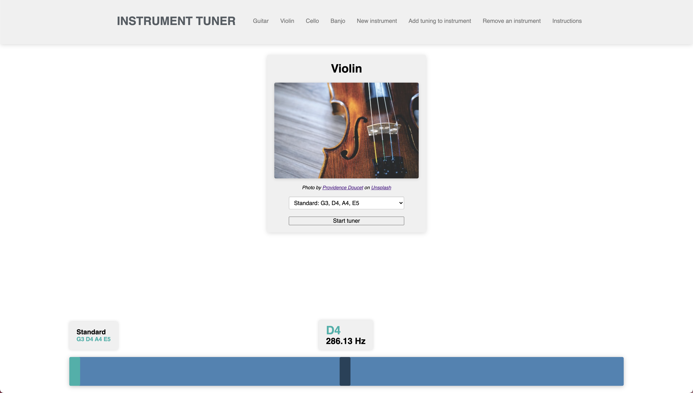
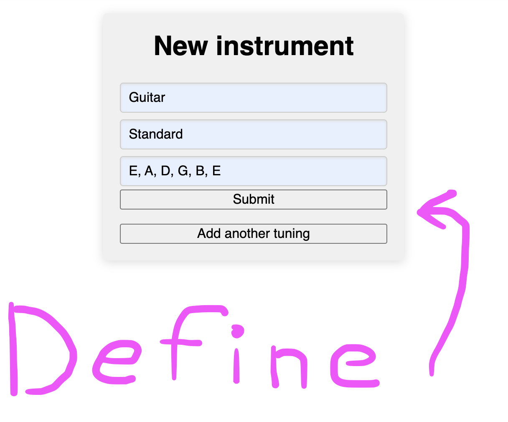

So, I have another project I'm supposed to show off. Don't mind if I do!

This time, I didn't go as all-out as usual because of some IRL stuff, but also because it just takes a lot out of me to work nonstop on something for so long, and I need to work on my perfectionism a little. But I'm still proud of it!

This time I made... (drum roll...)

#### An instrument tuner!



Because why not? I have a guitar, and my tuner needed new batteries so I was like, why spend 15 minutes buying batteries when I could spend 2 weeks building my own tuner? 😂

## Features

With this tuner, it's customizable for different instruments. So you can define your own instruments and tunings to let you tune pretty much whatever.



Instruments can have multiple different tunings saved for easily going back to different tunings. You can also delete instruments, or if you try to enter invalid data, it will show you an error.

When you create an instrument, a pretty image by some generous person from Unsplash will automatically be fetched (with attribution) and displayed above the tuner to give you some eye candy while you tune your instrument. No need to upload your own 🙂

Finally, there is a really basic instructions page that shows you the general flow of how to use the app.

That's about it! I went for something simpler this time like I said. But some of the functionality was actually really complicated to implement still.

## Some of the more interesting bits of the project

The backend is pretty basic, with the most interesting stuff being some custom validations and a service class that searches Unsplash for you when instruments are created and grabs the first result. I have one has-many/belongs-to relationship between `Instruments` and `Tunings`, and some associated model serializers courtesy of the `jsonapi.rb` gem which made creating my api pretty simple. Thanks, `jsonapi.rb`! 👍

The pure-vanilla-Javscript frontend is where the 'magic' happens, although there's no magic actually, just lots of code.

### Pitchfinder and how I use it to detect notes and create a tuner

I have a dependency on a javascript library called `pitchfinder` that lets me use the Webaudio API built into modern browsers to get some audio input, then pass it on to one of `pitchfinder`'s pitch detection algorithms inside an `onaudioprocess` block. There wasn't too much documentation at `pitchfinder`'s repo, so this took some heavy documentation browsing on MDN's Webaudio API pages to figure out and get working right. I also had to play around and experiment with the different algorithms available in `pitchfinder` for a bit to find the one that seemed to work best for my use case. But it seems to work nicely now! 

Some folks may want to see how to use Pitchfinder since its documentation is sparse, so here's a chunk of example code that let me get it working with browser mic input:

```javascript
navigator.mediaDevices
  .getUserMedia({ audio: true, video: false })
  .then((stream) => {
  const audioContext = new AudioContext()
  const source = audioContext.createMediaStreamSource(stream)
  const processor = audioContext.createScriptProcessor(2048, 1, 1)
  processor.onaudioprocess = (event) => {
    const micData = event.inputBuffer.getChannelData(0)
    const detectPitch = Pitchfinder.ACF2PLUS({
      sampleRate: audioContext.sampleRate
    })
    this.currentPitch = detectPitch(micData)
  }
  source.connect(processor)
  processor.connect(audioContext.destination)
})
```

Fun stuff! Hope that's handy for someone. 😃

It also was a fun exercise for me to figure out how to get that tuning display to respond correctly to the detected pitch coming from the user's audio input and show them whether they're in tune or not graphically. Check this mess of code out:

```javascript
drawGuage(layout, interval) {
  if (!this.guage()) {
    this.createGuage(layout)
  }
  if (this._guageInterval) {
    clearInterval(this._guageInterval)
  }
  this._guageInterval = setInterval(() => {
    const unit = window.innerWidth / 10
    let min = Tuner.convertNote(this.currentNote)
    let mid = this.currentPitch
    let max =
        Tuner.pitchMap[
          Tuner.noteScaleArray[
            Tuner.noteScaleArray.indexOf(this.currentNote) + 1
          ]
        ]
    mid = mid < min || !mid ? min : mid
    mid = mid > max ? max : mid
    let range = max - min
    range = range <= 0 ? 0.0001 : range
    let position = mid - min
    position = position < 0 ? 0 : position
    let percentage = range <= 0.0001 ? 1 : position / range
    let final = percentage * (unit * 8) + unit
    final = final > unit * 9 ? unit * 9 : final
    if (this.needle()) {
      this.needle().style.left = `${final}px`
    }
  }, interval)
  return this
}
```

Here, I am first creating a few little `div`s that I style using Sass where you see the method `this.createGuage()`. 

After that, I then clear the current interval if one already exists so that I don't have a bunch of code running all at once trying to do the exact same thing all the time. 

Next, I create a new interval that runs at a customizable pace (my app right now does it every 16ms or so) that gets the current screen width and divides it into a base unit that I use to define the boundaries of the tuner guage div and the position of the tuning guage marker. Next, using some helper methods, I take the minimum of the range of pitches that the currently detected note could possibly be, as well as the currently detected pitch, and the minimum pitch of the next note up in the chromatic scale, and do a bunch of simple math to compute a percentage of the length of the tuner guage `div` that the green tuning marker should have its position updated to in order to reflect how far you are from the ideal pitch for the currently detected note. The markers position is then updated accordingly based on whatever the computed distance unit currently is. (In case you can't tell, this is what makes my tuner responsive to different screen widths as well!) 

Phew!

### Communicating with the API to create page content

For something a little easier on the brain, I also needed a way to grab the instruments saved in my backend and create links in my navbar for each of them. This was kinda fun to do because I love doing stuff with `Promise`s and `fetch` and stuff 🙂

So I created a little reusable method in my `Client` class that talks to my api in a generic way and just returns the whole promise chain from my `fetch` call.

```javascript
fetchData(route) {
  return fetch(this.baseURL + route, {
    headers: { Accept: 'application/json' }
  })
    .then((response) => response.json())
    .then((json) => {
    if (json.status && json.status == 'error') {
      const errorModal = new ErrorModal(json.message, 5000)
      errorModal.display()
    }
    return json
  })
    .catch((error) => {
    console.error(error)
  })
}
```

As you can see, if the fetch fails, it creates a little error modal showing what went wrong. Otherwise, it converts the response to `json`. 

Then from there I made some tiny methods that are more specific about what to fetch. Here's what i use to fetch instruments for my navbar and stuff: 

```javascript
getInstruments(filter) {
  return this.fetchData(`instruments${filter ? filter : ''}`)
}
```

It optionally accepts a filter so you can basically search my API for instruments that meet certain criteria. Otherwise, it just grabs them all and again returns the `	Promise` chain so I can do stuff with the data later.

Here's where I actually use it to populate my navbar with links:

```javascript
static createFromData = (parent, layout, client, tuner, interval) => {
  return client.getInstruments().then((instrumentJSON) => {
    Instrument.createInstrumentsFromJSON(instrumentJSON, client).then(
      (instruments) => {
        const sections = []
        for (const instrument of instruments) {
          sections.push({
            name: instrument.name,
            onClick: instrument.display.bind(
              instrument,
              layout.content(),
              layout,
              tuner, 
              interval
            )
          })
        }
        sections.push(
          {
            name: 'New instrument',
            onClick: Forms.createNewInstrumentForm.bind(
              Forms,
              layout.content(),
              layout,
              client
            )
          },
          {
            name: 'Add tuning to instrument',
            onClick: Forms.createNewTuningForm.bind(
              Forms,
              layout.content(),
              layout,
              client
            )
          },
          {
            name: 'Remove an instrument',
            onClick: Forms.deleteInstrumentForm.bind(
              Forms,
              layout.content(),
              layout,
              client
            )
          },
          {
            name: 'Instructions',
            onClick: layout.createHowToStuff.bind(
              layout,
              layout.content()
            )
          },
        )
        const navbar = new Navbar('Instrument tuner', sections)
        navbar.appendToParent(parent, layout)
        return navbar
      }
    )
  })
}
```

To make the different sections actually do something when you click them, I create an object with a property called `onClick` that stores a bound method with some different arguments inside. Later on I grab that method from inside the object I created and run it to create the page content when you click on the navbar. Yay for `bind` letting me store arguments for later use!

In building this, I found out you actually can use ES6 arrow functions with Javascript's `bind` method, it just is discouraged because `this` will do strange things in that case. But it works if you don't care about `this`! That was before I recombobulated my app into an object-oriented style though, so it's not happening in my app anymore as I am not using arrow functions for my class methods, but it was a fun thing to discover.

## Enough code, my brain hurts

Okay, I hear you loud and clear! I'll wrap up then.

This project was fun to build as ever, and while sometimes I am still amazed that it even works at all, I am proud of it. It could certainly be improved, maybe with better styling, or a better landing page, or hosting, or a way to customize the tuner more (like being able to define a custom pitch for A4 that isn't 440hz). But for now, I'm just happy to have gotten something useful made. I have actually used it to tune my guitar, so at least I solved my original problem! 😎

### LInks and stuff

My project currently isn't hosted anywhere, but the code is up on Github as always. [Here's the backend](https://github.com/ghemsley/instrument-tuner-backend) and the [frontend lives here](https://github.com/ghemsley/instrument-tuner-frontend). It's not as hard to set up as my last project, so feel free to clone it and use it or make changes if ya want! And if you have any feedback for me, feel free to leave a comment. Haven't seen one of those around here in a while. Oh well 😂

## Thanks for reading!

