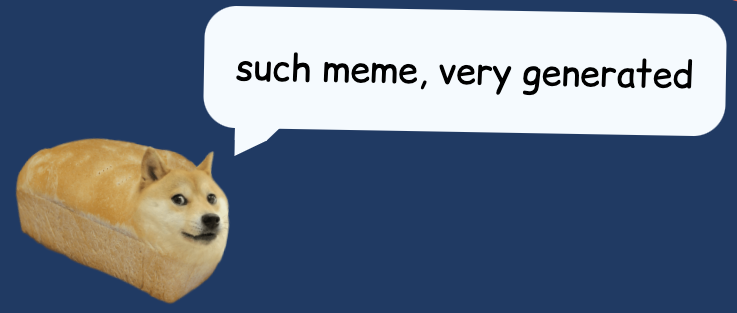
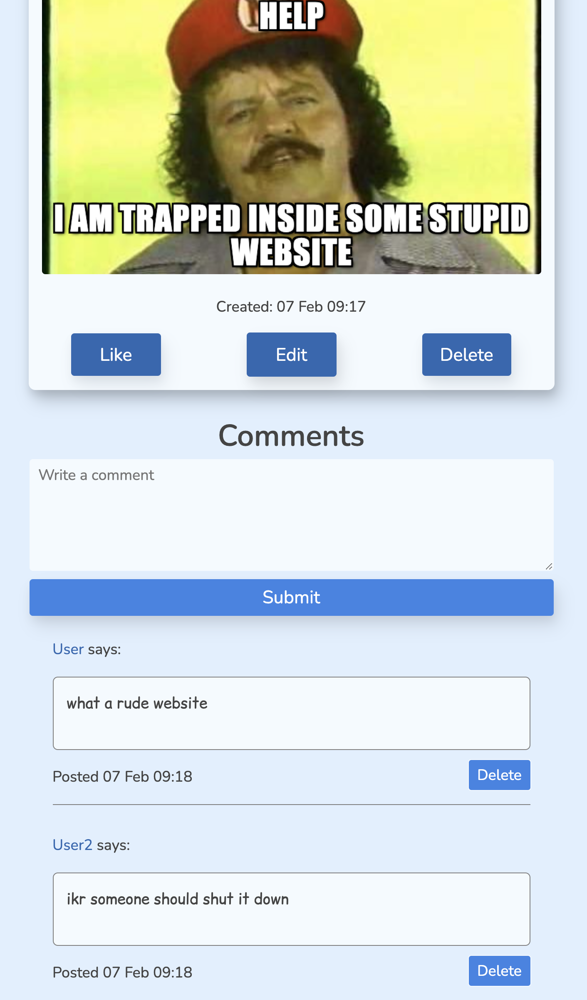
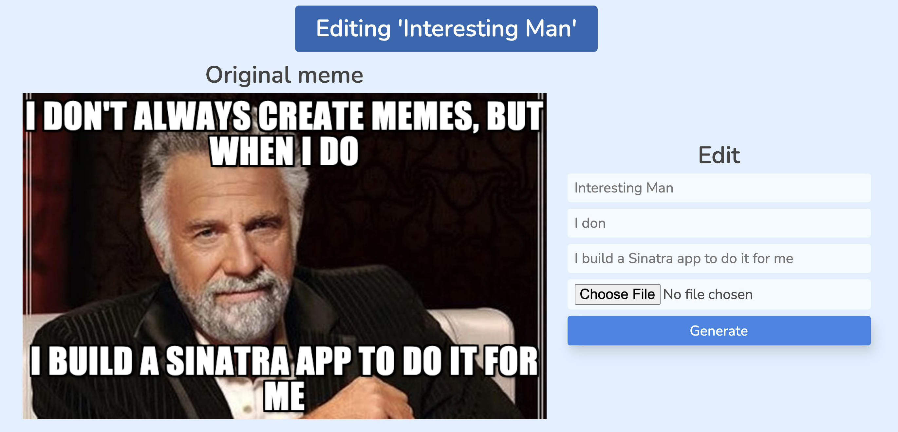

I've had a slightly low mood this winter as I'm sure is common these days, and at a point it began to interfere a bit with my work at school. I guess a combination of stress, uncertainty, burnout (my last project ended up taking some slight toll on me), and seasonal affective disorder turns out not to lend itself to productivity. While in this state, I started to wonder how I was going to manage putting together my next project. While I really enjoyed building the last one, it is difficult to code while one's mind is so far elsewhere. So in my brainstorming I tried to think of any project I could that would be maybe not as complex as my coffee finder app, but that I would still enjoy working on enough to be able to make it through the whole building process. I had an idea: What if I did something fun, or funny, so that at least while I was thinking about my project, I could escape from all the not-so-funny goings on of the world at large? Maybe it would help me out of my slump. This was a testable theory, so as soon as I had caught up on my schoolwork, I began attempting to test it.

The result of that test: A meme generator! And also no more slump 😁


## What does it do?

It takes an image of the user's choice, along with some text, then after some discombobulatory process involving lots of haphazard Javascript, it spits out a meme with that text overlaid on the image in typical meme fashion. Then there's this whole social-networky thingy that sort of formed around the generator, because why not? You can sign up, log in, create memes, edit memes, delete memes, like memes, post comments, follow other users, and a little more. It even has rudimentary moderation features, and a random-quote-spouting bread-based doge-based mascot thing! I may have gone a little overboard again, although perhaps in a slightly different direction this time. In any case, I hope someone enjoys my poor attempts at humor. If not, at least I lifted my own spirits a little.



## How was it made?

This meme generator is based primarily on Sinatra and ActiveRecord, with significant help from some other Javascript libraries and Ruby gems. The meme generation itself is first done with some custom Javascript and CSS, after which I employ a modal dialog library called `Tingle` to display it, then a library called `dom-to-image-more` saves the meme as an image. The information used to create the meme is stored in a database so that it can be referenced and potentially edited later. Following that, I use `Carrierwave` to save the image and its metadata to the server. There are other little helpers I use throughout the site, like an excellent Javascript slider widget library called `TinySlider`, or the gem `sanitize` for stripping out HTML and CSS from data entered by users. I also received help on implementing the user following functionality from [an excellent guide by Leizl Samano](https://medium.com/better-programming/how-to-create-a-follow-feature-in-rails-by-aliasing-associations-30d63edee284). Actually, I had all sorts of help building this from all sorts of documentation sites, blogs, Stack Overflow posts, etc. It was not actually the simple project I envisioned at the beginning (embarrassingly, there are over a thousand lines of SCSS alone for this one), but with that help, I guess I managed.


### Noteworthy bits and bobs

#### Likes

After a meme has been created, it can be liked by any user. A meme's likes are counted and the total displayed on the meme's card element. Once a user likes a meme, it is added to their 'liked memes', viewable from their account page. They can unlike a meme to remove it from their liked memes page, and the meme's like count will be updated accordingly. Nifty!

#### Comments

Underneath a meme, there is a form to add comments to that meme. It's only accessible if you're signed in. Once a comment has been created, it can't be edited, but it can be deleted if you are the user who created it, or if you're the admin (more on that soon).



#### Editing a meme

Memes can be edited after creation. Everything about them can be changed, including the meme's name, text, and image, so theoretically some low-level trolling is possible if a user amasses lots of likes and comments on a meme and then changes it. But having full CRUD (Create Read Update Delete) functionality on a resource belonging to a user was a requirement of the assignment, so I opted to leave that option available to users so as not to fail the project instantly 😁

The editing flow is hopefully a simple enough one for users, but behind the scenes it was the probably the most complex part of the project for a few fairly boring reasons, namely that I'm not so great at Javascript yet. The edit page could be designed a little clearer, and there's a bug caused by certain characters in the form placeholder I realize, but for now, at least it works.



#### The admin account

Just in case a user generates a slightly-too-spicy meme, there are rudimentary moderation features accessible by a special admin account. The admin account is created if the user sets a certain password and username combo, where the password is an environment variable that only I get to know. If the environment variable isn't available, no admin accounts can be created. This basically lets me be the only user with moderation privileges, which include editing other users' account username and password, deleting other user accounts, deleting any meme or comment I want, and seeing a list of all users with links to their account pages.


#### Javascript

In order to get javascript working inside my Sinatra views, I actually ended up setting up NodeJS and Webpack, and also using the gem `sinatra-js` to expose Ruby variables to the clientside Javascript environment. I felt a little bit creative for getting it all to work together. Here is an example of using `sinatra-js` in a Ruby `.erb` template to let the browser get data from the server and use it to let the user edit an existing meme:

```javascript
<% js_custom_add("
var user_id = #{@user.id}
var meme_id = #{@meme.id}
var originalImageSrc = \"#{@meme.original_image.url}\"
var originalName = \"#{@meme.name}\"
var originalTopCaption = \"#{@meme.top_caption}\"
var originalBottomCaption = \"#{@meme.bottom_caption}\"
")%>
<% js_custom_add_file('js/editDomToImage.bundle.js') %>
```

Here, `editDomToImage.bundle.js` is the Webpack-compiled version of the script I wrote for the meme editing functionality. We haven't been taught Javascript yet, so I am sure my Javascript code could be much better than what it is, but below is another example. In this one, I show the submission of an invisible form containing the user's submitted information regarding the edited meme:

```javascript
const formData = new FormData()
formData.append('meme[name]', name)
formData.append('meme[top_caption]', topCaption)
formData.append('meme[bottom_caption]', bottomCaption)
formData.append(
  'meme[image]',
  file2,
  name + `.${file2.type.split('/').pop()}`
)
fetch(`/memes/${meme_id}`, {
  method: 'PATCH',
  body: formData
})
```

Note that this invisible form is separate from the visible one I showed a picture of earlier. The visible form contains the input information used to generate a meme, but that information isn't sent directly to the server. Instead, a DOM node is created with that information appended and styled using CSS, and then `dom-to-image-more` lets me generate an image from that node, after which point the invisible form takes over, sending all the original input as well as the generated meme image to the server. From there, the information except for the images are stored in the database with ActiveRecord. For the images, Carrierwave stores the file in a public `uploads` directory and generates a url so that the file can be pointed to from within Sinatra later. Lots of moving parts to this project! But that's what makes it fun 😎

## Things to improve on

### If statements from hell

I would like to improve on what I like to call 'if statements from hell' in my Sinatra controller classes:

```ruby
patch '/users/:id' do
    if signed_in?
      user = current_user
      if user&.id == params[:id].to_i || user&.admin
        if params[:user][:password] && user.authenticate(params[:user][:password])
          if user.id == params[:id].to_i
            user.username = Sanitize.fragment(params[:user][:username]) if params[:user][:username]
            user.password = params[:user][:new_password] if params[:user][:new_password]
            if user.save
              flash[:success] = 'Success: saved account info!'
              redirect "/users/#{params[:id]}"
            else
              flash[:error] = 'Error: Failed to save account info, username may be taken or invalid'
              redirect "/users/#{params[:id]}/edit"
            end
          elsif user&.admin
            user_to_edit = User.find_by_id(params[:id])
            user_to_edit.username = Sanitize.fragment(params[:user][:username]) if params[:user][:username]
            user_to_edit.password = params[:user][:new_password] if params[:user][:new_password]
            if user_to_edit.save
              flash[:success] = 'Success: saved account info!'
              redirect '/'
            else
              flash[:error] = 'Error: Failed to save account info, username may be taken or invalid'
              redirect "/users/#{params[:id]}/edit"
            end
          else
            flash[:error] = 'Error: You do not have the required permissions'
            redirect '/'
          end
        else
          flash[:error] = 'Error: Failed to authenticate'
          redirect "/users/#{params[:id]}/edit"
        end
      else
        flash[:error] = 'Error: You do not have the required permissions'
        redirect '/'
      end
    else
      flash[:error] = 'Error: You are not signed in'
      redirect '/signin'
    end
  end
```

There are a lot like that. I haven't had time yet to come up with a good way to refactor things so that I can still have descriptive `flash` gem success/error messages and different redirects for everything that might go right or wrong during a request. I am sure there is some super-elegant and obvious way to do this, but I only just got out of "get it working" mode and am just now carefully peeking my head out into "how can I refactor" land. For whoever has to review my code, I'm very sorry.

### The design of the site

As you can tell, I'm not a designer. I don't know what I'm doing when it comes to creating a page layout. I hope to improve on that in the future, for sure. To some extent, I tried to play off of my bad design skills a little with this site as a bit of a joke. But I'm not sure if anyone will appreciate my heavy use of Comic Sans or not.

### Heroku's ephemeral file storage

After uploading my site to Heroku (which in itself was a huge pain), I found out that Heroku periodically cleans out your project directory's files that aren't checked into git, or something. So that means that the files uploaded by users currently aren't very persistent. I hope to be able to either find different hosting, or to modify the project to get around this limitation of Heroku.

## Final thoughts

I had fun building this project (as I hope you can tell). It's not perfect by any means, nor does it have the somewhat more refined code of Coffeefinder. But I like it and am hoping to keep working on it as my time allows. I hope someone gets a kick out of it like I did from the process of making it.

I should mention that you can play around with my app at [its home on Heroku](https://wow-meme-generator.herokuapp.com/). The source code lives at [Github](https://github.com/ghemsley/meme-generator). 

Thanks for reading my silly, silly blog.
