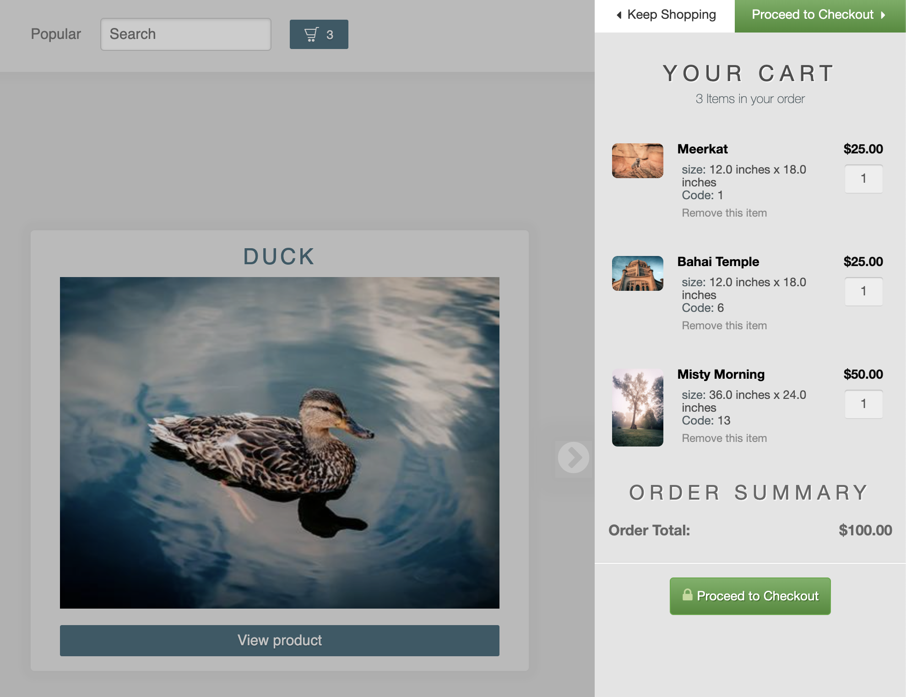
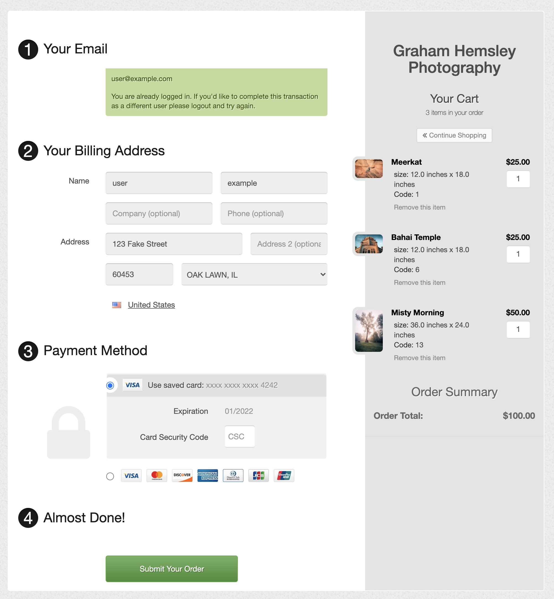
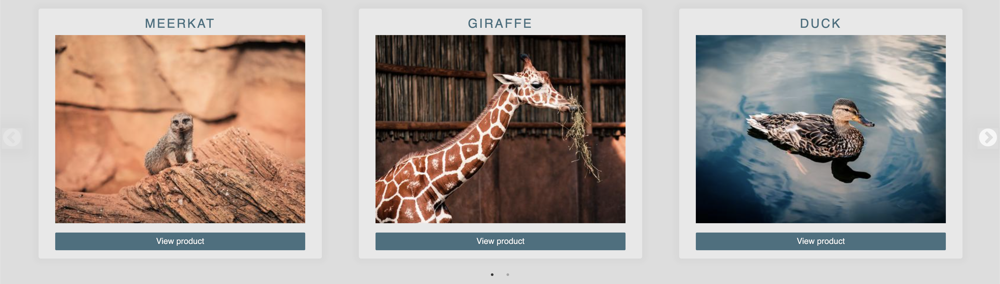

My latest project at school is one that I was initially a little intimidated by when I first (mis)read the requirements. There I was, fresh out of Sinatra-land, with hardly a spare moment to rest, and now I was supposed to build another Ruby web app, only... bigger? My [meme generator](/posts/memes-for-fun-and-profit) was plenty big, thank you very much. Luckily, both of the following were true: 

1. At first I misunderstood that the project requirements involved twice as many model relationships as they actually did.
2. If I am a wizard (I'm not) and Sinatra is a magic scroll (what is this analogy even?), then Ruby on Rails is an entire tome of magic scrolls, and it gives you +1d20 to all intelligence checks while programming. (Nerd level: ∞)


This metaphor falls apart quickly for those unfamiliar with Dungeons and Dragons, but I guess what I'm trying to say is that Ruby on Rails is a very powerful framework that does a lot of the boring work for you so that you can focus on the more interesting parts of your app's logic right away. 

I had other problems though. What to build? And if meeting the requirements is a 100% effort, how could I give a 110% effort so that I could hopefully be that much more happy with my result?

## Reaching for my interests

To tackle that first problem, I had a long think about which of my hobbies or interests I might enjoy playing with for this project. Music seemed a little complex to build something interesting with in a short time, as my mind immediately jumps to stuff like SoundCloud, and building some interactive thing like that sounded probably above my pay grade. I had already done coffee and memes in my other projects. But aha! I haven't taken a photo since The Before Times. Maybe photography would be fun to explore? 

So then I thought about how to incorporate photography into some kind of project of mine. I didn't want to go too overboard, and I wanted to try something a little more serious than my last two projects, so I came up with the idea of creating an eCommerce app where pretend users could pretend to buy prints of my not-quite-as-pretend photos. Eureka!

This had the nice side-effect of giving me a chance to work on something similar to what I might do in an actual software development position, at least the way my silly head imagines it. To my delight, this aspect of my project has lent me an unexpected amount of pride and satisfaction about my efforts. Something about doing a project that feels more 'real' has been very motivating and engaging, even without mentioning the small insights I've gained about building eCommerce applications in practice while stumbling my way towards a finished product.

## Attempting to give a 110% effort

I guess my default for these projects has become to look at what is expected, then see how I can bend the rules towards a shape that will allow me to at once maximally learn and grow as a student and developer, have a stupid amount of fun building something, and still check all the boxes of having done (approximately?) what is required, or with some luck a little more. I am very thankful for the flexibility of my school's instructors and curriculum so far, because it has allowed me to really flex my humble muscles of creativity through these projects in ways that have been very gratifying. I really have enjoyed working on these projects a lot.

That is all to say that for this project, I am back to my old ways of bending the rules a little (or perhaps a lot). We will see how far the girders of my school's curriculum structure will flex this time, but hopefully I have at least met most of the core expectations again.

To be more specific about what was expected for this project, the requirements were approximately: 

- To build something with Ruby on Rails,
- To achieve a complete many-to-many relationship between several models while also having a user-submittable attribute present on the join table for said relationship, 
- To include reasonable validations in the models with errors somehow displayed upon an unsuccessful form submission,
- To incorporate an ActiveRecord 'scope method',
- To somehow include local signup, login and logout functionality, as well as some sort of third-party authentication,
- To 'nest' the application routes so that one model is displayed or changed *from within another model's route*.

That was a lot! And like I said, I mistook the second requirement for being double its complexity due to the wording on one of our assignment readmes. So I felt I had to start a little early on this project just to get what I thought was the minimum done, let alone expand upon it somehow. Let me explain what all I actually built, I suppose.



### The Rails portion

Below is a rough pseudocode outline of the models I have created:

```ruby
class Admin
  username
  email
  password_digest
  
class User
  has_many :quantities
  has_many :products, through: :quantities
  email
  password_digest
  uuid
  
class Category
  has_many :products
  name 
  description
  
class Product
  has_many :dimensions
  has_many :quantities
  has_many :users, through: :quantities
  belongs_to :category
  name
  description
  tags
  price
  price_unit
  
class Dimension
  has_one :price_modifier
  belongs_to :product
  width
  length
  height
  weight
  distance_unit
  weight_unit
   

class PriceModifier
  belongs_to :dimension
  number
  unit
  
class Quantity
  belongs_to :user
  belongs_to :product
  amount
  
# There are a few currently unused models in my repo and some of the dimension fields are also currently unused
# I have left those in in case I expand on the project someday with things like frame options or transaction history
```

In addition to a controller for each of those models, I also have controllers for `sessions`, `webhooks`, `searches`, and `home`.

On the topic of controllers, this is one area where I sort of let my finger slip on the keyboard a few times. I would like to draw attention to my integration of a service called [FoxyCart](https://www.foxy.io/) at this time (ohboyherewego.jpg)

FoxyCart is an interesting kind of eCommerce SaaS platform that specializes in a heavily customizable shopping cart widget and associated transaction functionality. I chose it for my project after initially trying another service called SnipCart, which was also very interesting but had insufficient documentation for an issue I ran into with their product page webcrawler. In any case, some of my app's functionality depends heavily on FoxyCart's service (which I am currently using in test mode until I can someday bother with becoming PCI compliant).

Aside from my cart button, shopping cart widget and all of my checkout functionality essentially coming from their service, I decided to take the scenic route to meet my third-party authentication requirement. More specifically, I have implemented Single Sign On functionality that relies on FoxyCart. This will take some explaining, and a heavy dose of example code.

#### My authentication flow

This is difficult to sum up succinctly, as there are several ways a user can create an account on my app.

Firstly, whenever a user account on my app is created, I also create an accompanying customer account for them with FoxyCart. Aside from being part of how I hopefully achieved the third-party authentication requirement, this lets me later fetch information about their transactions from FoxyCart to enable a 'Popular Products' feature that my app possesses. Below is a code snippet that shows how I do that, in my `UsersController` `create` action. Actually, this action relies on several private utility methods in my `UsersController` and also my `ApplicationController`. Below are the relevant methods in my `ApplicationController` (don't worry, I will explain them):

```ruby
def foxycart_api_request(url: nil, method: nil, request_data: nil, access_token: nil, refresh_token: nil)
    uri = if url
            URI(url)
          elsif refresh_token
            URI('https://api.foxycart.com/token')
          else
            URI('https://api.foxycart.com')
          end
    if !refresh_token
      case method&.downcase
      when 'get', nil
        req = Net::HTTP::Get.new(uri)
      when 'post'
        req = Net::HTTP::Post.new(uri)
      when 'patch'
        req = Net::HTTP::Patch.new(uri)
      else
        logger.info "Warning: invalid method for API request, defaulting to 'get'"
        req = Net::HTTP::Get.new(uri)
      end
      req['Content-Type'] = 'application/hal+json'
      req['FOXY-API-VERSION'] = '1'
      req['Authorization'] = if access_token
                               "Bearer #{access_token}"
                             else
                               "Bearer #{ENV['NEW_FOXYCART_ACCESS_TOKEN'] || Rails.application.credentials.foxycart_access_token }"
                             end
      if method&.downcase == 'post' || 'patch'
        if request_data.respond_to?('deep_stringify_keys')
          req.set_form_data(request_data.deep_stringify_keys)
        elsif request_data
          req.set_form_data(request_data)
        end
      end
    else
      req = Net::HTTP::Post.new(uri)
      req['Content-Type'] = 'application/hal+json'
      req['FOXY-API-VERSION'] = '1'
      auth = Base64.strict_encode64("#{Rails.application.credentials.foxycart_client_id}:#{Rails.application.credentials.foxycart_client_secret}")
      req['Authorization'] = "Basic #{auth}"
      req.set_form_data('grant_type' => 'refresh_token', 'refresh_token' => refresh_token)
    end

    res = Net::HTTP.start(uri.hostname, uri.port, use_ssl: true) do |http|
      http.request(req)
    end

    case res
    when Net::HTTPSuccess, Net::HTTPRedirection
      if refresh_token
        data = JSON.parse(res.body)
        access_token = data['access_token']
        logger.info 'Making test request with refreshed token...'
        test_res = if url
                     foxycart_api_request(url: url, access_token: access_token)
                   else
                     foxycart_api_request(access_token: access_token)
                   end
        case test_res
        when Net::HTTPSuccess, Net::HTTPRedirection
          logger.info 'Test request successful!'
          ENV['NEW_FOXYCART_ACCESS_TOKEN'] = data['access_token'].to_s
          pp test_res
        else
          pp test_res.value
        end
      else
        pp res
      end
    when Net::HTTPUnauthorized
      logger.info 'Unauthorized: Refreshing token...'
      new_res = foxycart_api_request(refresh_token: Rails.application.credentials.foxycart_refresh_token)
      case new_res
      when Net::HTTPSuccess, Net::HTTPRedirection
        pp new_res
      else
        pp new_res.value
      end
    else
      pp res.value
    end
  end

  def get_foxycart_data
    res = foxycart_api_request
    case res
    when Net::HTTPSuccess, Net::HTTPRedirection
      data = JSON.parse(res.body)
      res = foxycart_api_request(url: data['_links']['fx:store']['href'])
      case res
      when Net::HTTPSuccess, Net::HTTPRedirection
        store_data = JSON.parse(res.body)
        res = foxycart_api_request(url: store_data['_links']['fx:customers']['href'])
        case res
        when Net::HTTPSuccess, NET::HTTPRedirection
          customer_data = JSON.parse(res.body)
          customer_list = customer_data['_embedded']['fx:customers']
          return { customer_list: customer_list, customer_data: customer_data, store_data: store_data, data: data } if customer_list
          nil
        else
          logger.error "Failed to get FoxyCart customer list"
          logger.error res.value
          return nil
        end
      else
        logger.error "Failed to get FoxyCart store info"
        logger.error res.value
        return nil
      end
    else
      logger.error "Failed to get make inital FoxyCart API request"
      logger.error res.value
      return nil
    end
  end
end

```

The first method shown is a method for making requests against FoxyCart's API. I am proud of it, despite its length! It is somewhat flexibly built, in that it can make your choice of get, post, or patch requests. Additionally, it is recursive, and can tell if a request fails due to an expired OAuth token (they expire every two hours), in which case it will automatically make another request to get a refreshed token, and upon a successful refresh it will resubmit the original request! 😎

The second method is just some refactoring I did to reduce redundant code. It makes a request against the `customers` portion of FoxyCart's api, and fetches data about all the customers associated with my store. One thing to note is that FoxyCart's API is a Hypermedia REST API, so each request helpfully returns links to other portions of the API. For boring reasons, I make several requests using these links to navigate their API most of the time rather than hardcoding certain API paths into my app. This is why you see those strange values for the `url` argument to my API request method.

Below is the actual user creation implementation for my app, making use of those two helper methods:

```ruby
def create_user_with_foxycart(params)
  user = User.find_or_initialize_by(email: params[:user][:email])
  if user && !user.uuid
    customer_list = get_foxycart_data[:customer_list]
    if customer_list
      customer = customer_list.find do |c|
        c['email'] == user&.email && (c['is_anonymous'] ==  0  ||
            c['is_anonymous'] == '0' ||
            c['is_anonymous'] == false)
      end
      if customer
        logger.info "Found customer #{customer['id']} matching user #{user.id} for email #{user.email}"
        if user.update(uuid: customer['id'],
          password_digest: customer['password_hash'])
          flash[:notice] = "Found existing customer with local user id #{user.id}"
        else
          user.errors.full_messages.each do |message|
            logger.error message
          end
          flash[:error] = "Found existing customer but failed to update attributes for user #{user.id}"
        end
        session[:current_user_id] = user.id
        redirect_to user_path(user)
      elsif user.update(password: params[:user][:password],
        password_confirmation: params[:user][:password_confirmation])
        create_foxycart_customer_for_user(user)
      else
        flash[:error] = "Failed to find FoxyCart customer or save new user attributes"
        redirect_to new_user_path
      end
    else
      flash[:error] = "Failed to get FoxyCart customer list"
      redirect_to new_user_path
    end
  elsif user
    flash[:error] = 'User with this info has aleady been created'
    redirect_to new_user_path
  else
    flash[:error] = 'Error: failed to create new user'
    redirect_to new_user_path
  end
end

def create_foxycart_customer_for_user(user)
  store_data = get_foxycart_data[:store_data]
  request_data = { 'email' => user.email, 'password_hash' => user.read_attribute(:password_digest) }
  res = foxycart_api_request(url: store_data['_links']['fx:customers']['href'],
    method: 'post',
    request_data: request_data)
  case res
  when Net::HTTPSuccess, Net::HTTPRedirection
    logger.info "Created new FoxyCart customer for user #{user.id}"
    customer_creation_data = JSON.parse(res.body)
    res = foxycart_api_request(url: customer_creation_data['_links']['self']['href'])
    case res
    when Net::HTTPSuccess, Net::HTTPRedirection
      customer_data = JSON.parse(res.body)
      if user.update(uuid: customer_data['id'])
        logger.info "Updated user #{user.id} with customer info from FoxyCart"
        flash[:notice] = "Sucessfully created new user"
        session[:current_user_id] = user.id
        redirect_to user_path(user)
      else
        flash[:error] = "Error: failed to save uuid for user #{user.id}"
        redirect_to user_path(user)
      end
    else
      error_string = "#{res.value}: Failed to fetch customer id for user #{user.id}"
      logger.error error_string
      flash[:error] = error_string
      redirect_to user_path(user)
    end
  else
    error_string = "#{res.value}: Failed to create FoxyCart customer for user #{user.id}"
    logger.error error_string
    flash[:error] = error_string
    redirect_to user_path(user)
  end
end
```

Basically, it finds or initializes a user based on the user's submittted email, then if the user doesn't exist on FoxyCart's side as a customer already, it creates an account for them, syncing their supplied details (including a hashed version of their password) between my app and FoxyCart. If the user *does* exist (which can potentially happen if they skip account creation on my site before checking out), then it fetches their details from FoxyCart, again syncing the two sides. Nifty!

By the way, updating a user on my app updates the associated customer on FoxyCart's side, of course.

Next, I'll show how Single Sign On is achieved in my app. This was hard to do! There were no Ruby examples in FoxyCart's documentation, only a few snippets of PHP (which I have never learned). I mostly flew by the seat of my developer pants, guided only by a plain English description of what a successful SSO implementation ought to do. I am very happy to have managed it!

Single Sign On relies upon another utility method that generates an authentication token based on some information. Below is that method:

```ruby
def fc_auth_token(customer_id, timestamp)
  foxycart_secret_key = Rails.application.credentials.foxycart_secret_key
  Digest::SHA1.hexdigest("#{customer_id}|#{timestamp}|#{foxycart_secret_key}")
end
```

So far, not too complicated. It is just hashing a stringified combination of a customer's ID, a timestamp, and my app's FoxyCart credential, separated by pipes. Next up is the real work: 

```ruby
def sso_redirect_foxycart_auth(params)
  timestamp = (Time.current + 1.hours).to_i
  user = get_user_if_signed_in
  if user
    foxycart_data = get_foxycart_data
    customer_list = foxycart_data[:customer_list]
    customer = customer_list.find do |c|
      c['id']&.to_i == user&.uuid.to_i && ( c['is_anonymous'] ==  0  ||
          c['is_anonymous'] == '0' ||
          c['is_anonymous'] == false )
    end
    if customer
      customer_id = customer['id']
      logger.info "Found customer #{customer_id} matching user #{user.id}"
      redirect_to "https://ghemsleyphotos.foxycart.com/checkout?fc_auth_token=#{fc_auth_token(customer_id, timestamp)}&fcsid=#{params[:fcsid]}&fc_customer_id=#{customer_id}&timestamp=#{timestamp}"
    else
      logger.info "Failed to find Foxycart customer for user #{user.id}, creating..."
      request_data = { 'email' => user.email, 'password_hash' => user.read_attribute(:password_digest) }
      res = foxycart_api_request( url: foxycart_data[:store_data]['_links']['fx:customers']['href'],
        method: 'post',
        request_data: request_data )
      case res
      when Net::HTTPSuccess, Net::HTTPRedirection
        logger.info "Created new FoxyCart customer for user #{user.id}"
        data = JSON.parse(res.body)
        res = foxycart_api_request(url: data['_links']['self']['href'])
        case res
        when Net::HTTPSuccess, Net::HTTPRedirection
          data = JSON.parse(res.body)
          if user.update(uuid: data['id'])
            logger.info "Updated user #{user.id} with customer info from FoxyCart"
            customer_id = data['id']
            redirect_to "https://ghemsleyphotos.foxycart.com/checkout?fc_auth_token=#{fc_auth_token(customer_id, timestamp)}&fcsid=#{params[:fcsid]}&fc_customer_id=#{customer_id}&timestamp=#{timestamp}"
          else
            logger.error "Failed to save user #{user.id}"
            flash[:error] = "Failed to save user #{user.id}"
            redirect_to root_path
          end
        else
          logger.error "#{res.value}: Failed to get customer info from FoxyCart"
          redirect_to root_path
        end
      else
        logger.error "#{res.value}: Failed to create new customer for user #{user.id}"
        redirect_to root_path
      end
    end
  else
    redirect_to "https://ghemsleyphotos.foxycart.com/checkout?fc_auth_token=#{fc_auth_token(0, timestamp)}&fcsid=#{params[:fcsid]}&fc_customer_id=#{0}&timestamp=#{timestamp}"
  end
end

def reverse_sso_redirect_foxycart_auth(params)
  remote_fc_auth_token = params[:fc_auth_token]
  remote_timestamp = params[:timestamp]
  fc_customer_id = params[:fc_customer_id]
  local_timestamp = (Time.current).to_i
  if remote_timestamp.to_i > local_timestamp && remote_fc_auth_token == fc_auth_token(fc_customer_id, remote_timestamp.to_i)
    customer_list = get_foxycart_data[:customer_list]
    customer = customer_list.find do |c|
      c['id'] == fc_customer_id.to_i && ( c['is_anonymous'] ==  0  ||
          c['is_anonymous'] == '0' ||
          c['is_anonymous'] == false )
    end
    if customer
      user = User.find_or_initialize_by(uuid: fc_customer_id)
      user.email = customer['email']
      user.password_digest = customer['password_hash']
      if user.save
        session[:current_user_id] = user.id
        flash[:notice] = "Signed in user #{user.email}"
        redirect_to user_path(user)
      else
        flash[:error] = "Failed to create new user account"
        redirect_to root_path
      end
    else
      flash[:error] = "Failed to find FoxyCart customer matching id #{fc_customer_id}"
      redirect_to root_path
    end
  else
    flash[:error] = "Failed to verify authorization token"
    redirect_to root_path
  end
end
```

The first method is called whenever someone hits the Checkout page. FoxyCart redirects them to a `SessionsController` action called `sso_redirect`, sending along some data that lets me identify the user and generate an authentication token for them. If the user is currently signed in on **my side**, I generate such a token and send the user to FoxyCart's hosted checkout page along with their token, creating a FoxyCart account for them beforehand if one doesn't already exist. At that point, FoxyCart checks to make sure the token is valid, and if it is, FoxyCart signs them in on **their side** and autofills the checkout page with all the relevant information it has about that user. If the user is *not* currently signed in on **my side** , I just send them over to FoxyCart's checkout page as an anonymous user. 

However! If the user wasn't signed in on my site before they checked out but they do in fact already have a FoxyCart account, then they still have a chance to sign in on FoxyCart's order page! If they do, then they can also still have their order form autofilled by FoxyCart. If the user was not signed in and their account *does not* already exist on FoxyCart, they have an opportunity to create an account while they complete their order form. This will become very important later when I explain the reverse SSO method shown above. But first, there is something that occurs when they successfully submit an order that is highly relevant to the project requirements as well. Please pardon the small detour!

When an order is successfully submitted, FoxyCart fires off a *webhook* that lands at an action of my `WebhooksController`. I will show that below: 

```ruby
def foxycart_webhook
  data = ActiveSupport::JSON.decode(request.body.read)
  if (data['_embedded']['fx:customer']['is_anonymous'] ==  0  ||
      data['_embedded']['fx:customer']['is_anonymous'] == '0' ||
      data['_embedded']['fx:customer']['is_anonymous'] == false)
    user = User.find_or_initialize_by(uuid: data['_embedded']['fx:customer']['id']&.to_s)
    user.email = data['_embedded']['fx:customer']['email']
    user.password_digest = data['_embedded']['fx:customer']['password_hash']
    if user.save
      logger.info "Saved user with id #{user.id}"
      data['_embedded']['fx:items'].each do |item|
        product = Product.find(item['code'])
        next unless product

        logger.info "Found product #{product.id}"
        quantity = Quantity.find_or_initialize_by(user_id: user.id, product_id: product.id)
        if quantity.amount == nil
          quantity.amount = item['quantity']
        else
          quantity.amount += item['quantity']
        end
        if quantity.save
          logger.info "Saved new quantity #{quantity.id} for user #{user.id} and product #{product.id} with amount #{quantity.amount}"
        else
          quantity.errors.full_messages.each do |message|
            logger.error message 
          end
          render status: :internal_server_error, json: quantity.errors.full_messages.to_json and return
        end
      end
      logger.info "Saved new quanitites for user #{user.id}"
      render status: :ok, json: "Saved new quantity for user #{user.id}".to_json
    else
      user.errors.full_messages.each do |message|
        logger.error message
      end
      render status: :internal_server_error, json: user.errors.full_messages.to_json
    end
  else
    logger.info "Webhook: User was anonymous"
    render status: :ok, json: data.to_json
  end
end
```

This webhook finds the just-checked-out user's account on my site if it exists, and grabs their transaction information from the data FoxyCart sends to me in its request. Based on that data, I can find out what products they just purchased, then create a new `Quantity` record for each of them in my database. A given quantity is associated with the user and a product, and it also has an `amount` attribute, which happens to be user submittable! The user can specify the `quantity`'s `amount` value either before checking out when they choose how many of a given item to purchase using my app's slide-out cart widget, or during checkout before they confirm their order, again by specifying how many of an item they would like to purchase. 

But enough with the webhooks, what about that Reverse SSO thing?

Well, when a user finally lands on FoxyCart's receipt page, they have the option to return to my site through a button that redirects them to my `SessionsController`'s `reverse_sso_redirect` action. If the user has chosen to create an account with FoxyCart at any point in time, then their customer ID is sent with the redirect request, along with another one of those Auth Tokens, only this time, it was generated by FoxyCart on **their side**. I use the information sent with the redirect request to generate an authentication token on **my side**, compare it from the one sent with the request to my app from **their side**, and if they match up, then I find or create an account and session for the user on **my side**. This is to prevent users from being able to spoof each other's sessions.

*Phew!*

So hopefully all of that counts somewhat towards a third-party authentication requirement. If not, I regret nothing, as I learned a ton implementing all that. Sorry for the complexity though! 😅



## But wait, there's more!

### The React portion

I configured Webpacker to allow me to use React to display the products of my app. This was partially because I just enjoy using React a lot, but also because there were some nice-looking component libraries I wanted to use to enable some bits of functionality, such as [a lightbox](https://github.com/theanam/react-awesome-lightbox) and [a slider carousel widget](https://react-slick.neostack.com/). First, I'll walk through my somewhat hefty ProductCard component:

```jsx
const ProductCard = (props) => {
  const json = JSON.parse(props.dimensions_json)
  const [open, setOpen] = useState(false)
  const [selected, setSelected] = useState(json[0].distances_string)
  const [loaded, setLoaded] = useState(false)
  const [price, setPrice] = useState(0)
  const urlRegex = new RegExp(/\/products\/\d+$/i)
  window.addEventListener('load', (event) => {
    setLoaded(true)
  })
  if (open) {
    window.addEventListener('contextmenu', disable)
  } else {
    window.removeEventListener('contextmenu', disable)
  }

  return (
    <div className={`product-card shadow  corner-rounded ${props.class_name}`}>
      <h2 className='product-title center'>
        <a href={props.url}>{props.name}</a>
      </h2>
      <div
        className={`product-image-container${
          props.full_size ? ' full-size' : ''
        }`}
      >
         {
            if (props.lightbox) {
              setOpen(true)
            }
          }}
          onContextMenu={(event) => {
            event.preventDefault()
            return false
          }}
          onDragStart={(event) => {
            event.preventDefault()
            return false
          }}
        />
      </div>
      {open && (
        <Lightbox
          image={props.image}
          title={props.name}
          onClose={() => {
            setOpen(false)
          }}
        />
      )}
      {props.show_description && (
        <>
          <div className='product-description-container'>
            <p className='tiny-text'>click image to see full size</p>
            <p className='product-description'>{props.description}</p>
          </div>

          <div className='price-cart-button-container'>
            <form className='pure-form margin-vertical-1'>
              <label>Sizes available: </label>
              <select
                id='size-select-dropdown'
                value={selected}
                onChange={(event) => {
                  setSelected(event.currentTarget.value)
                  json.forEach((dimension, i) => {
                    if (
                      dimension.distances_string == event.currentTarget.value
                    ) {
                      setPrice(dimension.price_modifier)
                    }
                  })
                }}
              >
                {json.map((dimension, i) => {
                  return (
                    <option key={i} value={dimension.distances_string}>
                      {dimension.distances_string}
                    </option>
                  )
                })}
              </select>
            </form>
            <p className='margin-0 padding-0 price-blurb'>{`Price: $${(
              parseFloat(props.price) + parseFloat(price)
            ).toFixed(2)}`}</p>
            {loaded && (
              <>
                <br />
                <a
                  className='cart-button pure-button button-success center'
                  href={`https://ghemsleyphotos.foxycart.com/cart?name=${props.name.replace(
                    ' ',
                    '+'
                  )}&price=${props.price}&image=${props.thumbnail}&url=${
                    props.url
                  }&code=${props.id}&size=${document
                    .getElementById('size-select-dropdown')
                    .value.split(' ')
                    .join('%20')}{p+${
                    json.find(
                      (dimension) => dimension.distances_string == selected
                    ).price_modifier
                  }}`}
                >
                  Add to cart
                </a>
              </>
            )}
          </div>
        </>
      )}
      {!props.show_description && (
        <div className='price-cart-button-container'>
          <br />
          <a
            className='cart-button pure-link pure-button button-success center'
            href={props.url}
          >
            View product
          </a>
        </div>
      )}
    </div>
  )
}
```

I'll start at the top! 

First, let me explain the whole JSON thingy. This JSON comes from my Product model back in Rails-land:

```ruby
def dimensions_json
  dimensions.collect do |dimension|
    { price_modifier: dimension.price_modifier.number,
      length: dimension.length,
      width: dimension.width,
      height: dimension.height,
      weight: dimension.weight,
      distance_unit: dimension.distance_unit,
      weight_unit: dimension.weight_unit,
      distances_string: dimension.distances_to_s }
  end.to_json
end
```

This method loops through all the existing `Dimensions` for a given `Product` and converts their attributes to a JSON string. Then with the line `const json = JSON.parse(props.dimensions_json)` in my React component, they are handily converted to objects for later use.

The lines 3 through 6 of the React component snippet are setting up state that helps me with enabling a lightbox display, changing my product's displayed price upon selection of a new set of dimensions in a small form, and setting up some FoxyCart functionality I depend on (I have to make sure that the page has finished loading before I try to interact with FoxyCart's sliding cart widget or fire any requests off to their servers, which is where the checkout stuff is hosted).

The URLRegex thing lets me test to see if the component is on the product detail page, and if so, it loads a larger version of the product image, otherwise if it's on any other page it loads a small thumbnail instead.

A little below all that stuff, I test to see if the lightbox is open, and if it is, I disable the context menu so that it's a little harder to steal the full-size versions of my photos. Then comes a ton of JSX!

Some of it is fairly self-explanatory, but there are a few parts that maybe aren't. I have also disabled the context menu as well as drag-and-drop for the small thumbnail, so there's that. I also have that little form I mentioned that lets users select which size print they would like to purchase. When that is changed, the price is updated, but it also modifies the parameters of the `GET` request fired when the product is added to the cart to reflect the user's choice of dimensions. The selected value needs to be URL escaped since it's essentially ending up in a link, so I replace the spaces with the appropriate hexadecimal value. Finally, if the showDescription prop is set, the product description and some other bits like the add-to-cart button are displayed, otherwise a simpler 'View Product' button is displayed.


#### Category Sliders

That's about it for that component, so next up is the `CategorySlider` component! 😃

```jsx
const CategorySlider = (props) => {
  let settings = {
    arrows: props.arrows,
    dots: props.dots,
    infinite: props.infinite,
    speed: props.speed,
    slidesToShow: props.slides_to_show,
    slidesToScroll: props.slides_to_scroll,
    autoplay: props.autoplay,
    autoplaySpeed: 5000,
    lazyLoad: props.lazy,
    adaptiveHeight: false,
    responsive: [
      {
        breakpoint: 1600,
        settings: {
          slidesToShow: 3,
          slidesToScroll: 1,
        }
      },
      {
        breakpoint: 1200,
        settings: {
          slidesToShow: 2,
          slidesToScroll: 1,
        }
      },
      {
        breakpoint: 800,
        settings: {
          slidesToShow: 1,
          slidesToScroll: 1
        }
      }
    ]
  }
  const json = JSON.parse(props.json)
  return (
    <Slider {...settings}>
      {json.map((product, i) => {
        return (
          <ProductCard
            key={i}
            id={product.id}
            name={product.name}
            show_description={props.description}
            description={product.description}
            price={product.price}
            price_unit={product.price_unit}
            url={product.url}
            image={product.image}
            thumbnail={product.thumbnail}
            thumbnail_large={product.thumbnail_large}
            dimensions_json={product.dimensions_json}
            lightbox={product.lightbox}
            class_name='padding-1 background-white corner-rounded'
          />
        )
      })}
    </Slider>
  )
}
```

Firstly, from the top, I set some settings of the slider component library I am using. Then more fun with JSON! This time it relies on a method in my Category component: 

```ruby
def slider_props_json
  products.collect do |product|
    {
      id: product.id,
      name: product.name,
      description: product.description,
      price: product.price,
      price_unit: product.price_unit,
      url: product_url(product),
      image: url_for(product.image),
      thumbnail: url_for(product.image.variant(resize_to_limit: [480, 720]).processed),
      thumbnail_large: url_for(product.image.variant(resize_to_limit: [1440, 2160]).processed),
      dimensions_json: product.dimensions_json,
      lightbox: false
      }
  end.to_json
end
```

Basically, for all the products in a given category, the method collects their attributes, gathers up some links to my ActiveStorage images, then also runs each product's `dimensions_json` method, and finally returns a JSON array full of objects describing my products.

Then back in the React component, I populate a slider widget with a ProductCard filled with props from each of the aforementioned `Product` objects in the JSON array. This is how I achieve component nesting (or whatever it might properly be called) when my components need to be dynamically created from objects coming from Rails-land, which is not as straightforward in a Rails app as it is in pure Javascript React.



### Searching for an end to this blog post

One last thing I want to spend a little time on is how I met the ActiveRecord scope method requirement. I created a little search from that lives in the header bar, and on the search result page I created a form that lets you apply filters to a search. The form inputs for the filters are named very carefully to match the names of my scope methods. Now, below are just a few of my scope methods, along with a filter method that automatically applies user-specified scopes to a search query to filter the query further by calling the scope method matching the name of the form params sent in the user's filter request. The scopes can all be stacked until the cows come home! Or at least until you have exhausted the options available for filters, which are plenty, and include filtering by price, dimensions, photo tags, and product name or description.

```ruby
  scope :name_contains, ->(string) { where('name LIKE ?', "%#{string}%") }
  scope :description_contains, ->(string) { where('description LIKE ?', "%#{string}%") }
  scope :tags_contains, ->(string) { where('tags LIKE ?', "%#{string}%") }
  scope :metadata_contains, lambda { |string|
                              name_contains(string)
                                .or(description_contains(string))
                                .or(tags_contains(string.strip))
                            }

  def self.filter_metadata(query, filters)
    search = metadata_contains(query)
    filters.each do |param_name, param_value|
      search = search.send(param_name, param_value) if param_value.present?
    end
    search
  end
```

This filter method is what is called on the set of all of my `Product` records when a user lands on my `SearchesController` `search` action. Fun!


## Links and stuff

Anyway, my reign of terror upon the audiences time must end at some point, and now that this blog post is twenty miles long, I feel now is as good a time as any. If for some reason you are still hungry to read more about what went into building my project, I recommend checking out [FoxyCart's Single Sign On documentation](https://wiki.foxycart.com/v/2.0/sso), as that was certainly the most complex aspect of my project. Please also feel free to check out [my project's Github repository](https://github.com/ghemsley/rails-photo-store).

Oh, almost forgot! My project is currently hosted on a tiny Linode VPS I set up, with Nginx sitting in front of its Passenger server. That was a bit of a ride to configure properly, but I won't go into it. In any case, please feel free to play with around with [the live instance of my project](https://photos.grahamhemsley.com/) as well! Don't worry, you won't be charged if you try to order a photo print, as the app is still in test mode for the foreseeable future. You can put in fake information and it should hopefully work fine.

I know this was long, so thanks as ever for your attention to my little blog 😁
