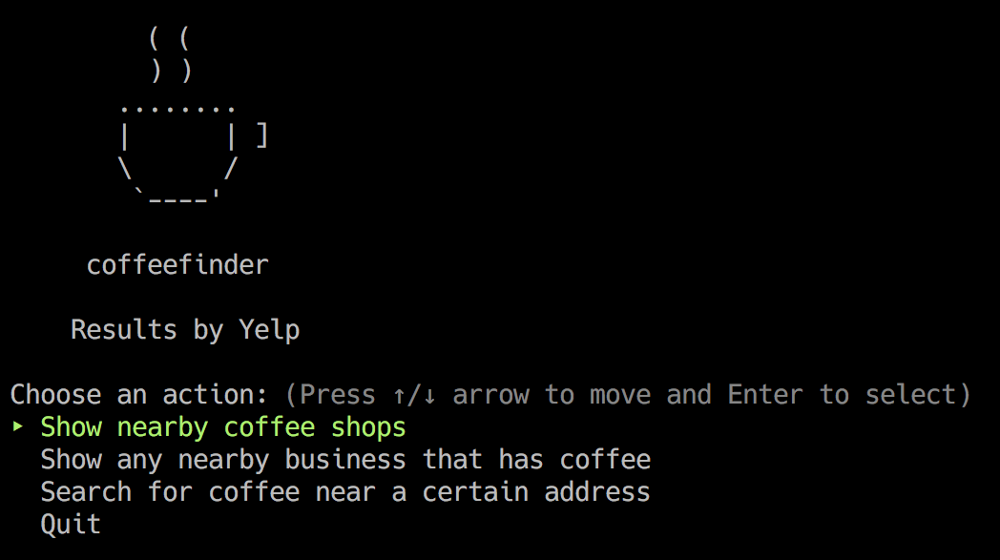
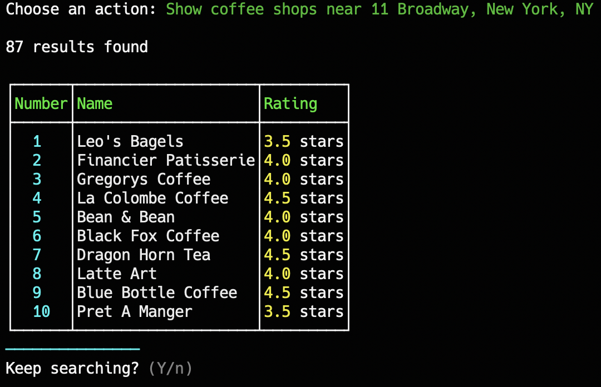
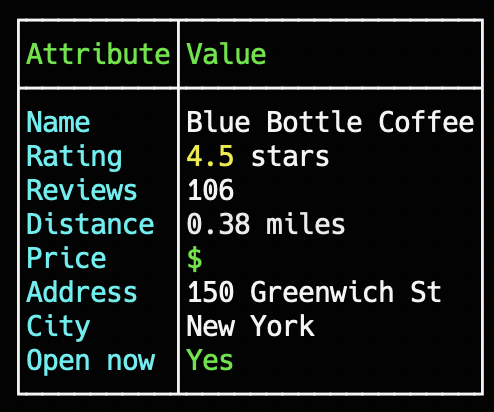

# When finding coffee gets complex

Recently at school, I was assigned the task of designing and building a [Ruby](https://www.ruby-lang.org/en/) application that meets the following requirements: 

1. It can be interacted with by the user via a [command-line interface](https://en.wikipedia.org/wiki/Command-line_interface)
2. It fetches data from a remote source using an [application programming interface](https://en.wikipedia.org/wiki/API)
3. The data fetched must go more than one 'level' deep, ie. it should be able to list items and then provide a detail view about a given item as well
4. It uses [object-oriented](https://en.wikipedia.org/wiki/Object-oriented_programming) design patterns

As soon as I heard this assignment was coming up, I was ecstatic! It sounded like a great way to practice what I have been learning, while having some freedom and flexibility to create a program of my own choosing that accomplished a useful task. In other words, it sounded like a lot of fun! I was looking forward to it so much that I just sort of jumped the gun and got started trying to figure out what to build right away. 

There were several challenging aspects of just this very first step, though. I wondered to myself for quite a while, "What task do I want it to complete? What APIs are out there that would fit the requirements? What project would be the most fun to build while still meeting all the demands of the assignment without being too large in scope?" So many questions! And nobody to answer them but me. So I deliberated for a while, and even started on several preliminary ideas before eventually settling on one that I ended up just running with.

Naturally, it involves coffee. ☕️

May I present to you: 

## Coffeefinder!



### What does it do?

As you might surmise from the image above, it helps a user find information about nearby places that sell coffee. I figured it would be fun to blend two of my favorite things, coffee and coding. (Nevermind that I do that on a daily basis.)

Here are the steps:

1. First, the program is launched from a terminal, potentially with some options specified using option flags.
2. Then the user selects whether to search near the user's detected location or whether to search by address. The results can be filtered to just return coffee shops (using a loose definition of the term), or any sort of business that sells coffee. 
3. Next, search results are returned in a tabular format, like so: 



4. Finally, the user can select from those listings to display a detailed view of a given business listing, as seen below:



At any point the user can quit or go back to the main menu to do another search.

### How does it work?

1. The user's [Ip address](https://en.wikipedia.org/wiki/IP_address) is checked against a [Geolocation](https://en.wikipedia.org/wiki/Internet_geolocation) API, specifically [IP-API](https://ip-api.com/).
2. The data returned includes latitude and longitude coordinates that are then sent to [Yelp](https://www.yelp.com/)'s [GraphQL](https://graphql.org/) API.
3. Yelp responds with business listings in [JSON](https://www.json.org/json-en.html) format.
4. This data is parsed and turned into an object, which I pull information from to create my own objects as needed.
5. The program [iterates](https://en.wikipedia.org/wiki/Iteration) on the collections of objects to create the various menus and listings you see above.

That's basically it! Unless you search by address, in which case the address is sent to Yelp instead of the coordinates. However, this simple set of steps belies the complexity of their implementation.

### Challenges involved in completing the project

Upon reflection, the hardest parts of building this were settling on an idea to get started with, and refactoring my code into something that wasn't completely monstrous. I explained how choosing an idea was difficult, and it actually took me several days to settle on something. However, it took me just as long after my program was in a workable state to sculpt the code into something presentable. There were also some other technical challenges involved in things like getting the two API's to talk to each other correctly and understanding the data they returned, or getting consistent formatting regardless of what options the user has set for the program to sort by, for example.

#### The refactoring process

If you want a hint of what it was like, understand that the process of refactoring involves taking working code and 'breaking' it so that it doesn't work anymore, in the hopes that you will land on a simpler codebase overall once you finish fixing everything. It can be quite stressful to do that when you're working with a deadline. 

This program currently spans 7 classes, three modules, an environment file, an executable file, and a main entry point file. There are a total of just over 800 lines of code between them (after significant refactoring!) I had to break it over and over and over and find new ways to express certain ideas through code to get it to where it is. It's not much in the grand scheme, but when you are just one person trying to build something in a few days, it becomes quite important that you keep everything as simple as possible. It helps very much to follow the grand rule: **Keep it DRY**. This means **D**on't **R**epeat **Y**ourself. (Actually, I don't know if that's really the grand rule but it's fun to say so.) 

In any case, this simple program turned out to be quite complex to build under the constraints given my experience level, and the biggest takeaway I have from it all is that learning how to manage complexity is *extremely* important when writing large amounts of code.

### Parts of the project that I am proud of

I am proud of how the code for the project is nicely separated into various types of tasks and concerns. I think I did a fairly good job splitting up those 800 lines into manageable-enough chunks. It wasn't always that way though, especially when I first got it into a working state. It's much better now after spending some time on refactoring. For example, the CLI class is mostly just limited to a series of `case` statements that describe the flow between menus, like so:

```ruby
def search_complete_menu
  yelp.offset = 0
  choice = prompt.search_complete_prompt
  case choice
  when 1
    business_menu
  when 2
    main_menu
  when 3
    exit(true)
  end
  nil
end
```

I am also proud of a few solutions I came up with. One of the problems I faced was that I needed a way to display only the businesses that were returned from the most recent Yelp API query. Otherwise, the list of businesses to display would grow, and grow, and grow even if you searched different addresses. That would quickly become confusing for the user. So I came up with a couple steps to solve the problem.

In the program's `Business` class (which stores information about business listings fetched from Yelp) I have these methods which find or instantiate `Business` objects and keep track of all of them using an array:

```ruby
@@all = []

def self.all
  @@all
end

def self.find_or_create_by_id(business)
  all.find do |existing_business|
    existing_business.id == business.id
  end || new(business)
end
```

In its `initialize` method I have: 

```ruby
self.class.all.push(self)
```

So every instance of a business is kept track of by the `Business` class, and the class can find instances of itself. That lets me do this, in the `Yelp` class where I manage queries and store search results in an array (a search in this context is an array of the business listing objects returned from a Yelp query):

```ruby
def searches_to_business_instances
  last_search_businesses = []
  searches.each do |search|
    search.business.each do |business|
      last_search_businesses.push(business)
    end
  end
  self.businesses = last_search_businesses.collect do |business|
    Business.find_or_create_by_id(business)
  end
  businesses
end
```

This method is accessing the array of search results (in the form of `Business` instances) and adding to it every business object that comes from my GraphQL query that came from the last search, then either finding or instantiating `Business` instances based on the objects in that array.

The previous method relies on the following methods in the `Yelp` Class being called throughout the program's lifespan to work:

```ruby
def save_search(search)
  searches.push(search)
  searches
end

def clear_searches
  searches.clear
  searches
end
```

These methods are what store the search results I obtain so that I can access those results later, or get rid of them when the user starts a new search. All of this basically prevents the search results from accumulating to an unmanageable size, and I am proud of the fact that I was able to come up with a reasonably simple and concise solution.

### Things to improve on

I wasn't sure how to implement many of the object relationships I have learned about in this project. To some extent I felt like the app didn't call for a complex relationship between most of the objects, but perhaps there is a way I could refactor it to include them in the future. Also, I noticed that taking a little break from coding or getting an outside perspective really helped me come back to the long refactoring process with new ideas on how to make things more manageable. I think that as far as my coding process goes, I could improve by taking more breaks instead of doing long sprints, as it seems to help me avoid getting stuck in a sort of rut when it comes to refactoring where I can't see any ways to keep breaking things down. I am sure I will find many more ways to improve my code as I go about my studies, of course.

## Final thoughts

This project was actually very fun to work on. I spent long nights staying up until the early morning coding, debugging, testing, and refactoring and I enjoyed every minute of it. I feel like I thrive and learn best with assignments like these where I have some flexibility to use my creativity and interests to help shape the outcome. I am excited for the next similar project to come around so that I can have such a fun learning opportunity again!

By the way, the code for this project lives at [GitHub](https://github.com/ghemsley/coffeefinder). 

You are very welcome to check it out and let me know what you think, or even, dare I say, fork it? 😃